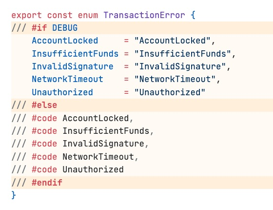

# ifdef-loader Syntax Highlighting

[](https://marketplace.visualstudio.com/items?itemName=reececomo.ifdef-loader-syntax-highlighting)
[](LICENSE)

Syntax highlighting for [**ifdef-loader**](https://www.npmjs.com/package/ifdef-loader) conditional compilation comments.

- ✅ Supports built-ins: `#if`, `#else`, `#elif`, `#endif`
- ✅ Supports `#code` uncomment prefix blocks (and custom prefixes)
- 🟡 Not supported: `"ifdef-triple-slash": false`



#### Recommended: Enable block highlighting

Configure block-level highlights - e.g. using the [**Highlight extension**](https://marketplace.visualstudio.com/items?itemName=fabiospampinato.vscode-highlight):

```json
// .vscode/settings.json
{
  "highlight.regexes": {
    "( *\/\/\/ #if.*)((?:.|\n)*?\n)( *\/\/\/ #endif)": {
      "filterFileRegex": ".*\\.(?:jsx?|tsx?)$",
      "regexFlags": "gm",
      "decorations": [
        {},
        {
          "isWholeLine": true,
          "dark":  { "backgroundColor": "#ffa81d28" },
          "light": { "backgroundColor": "#ffa81d10" }
        },
        {}
      ]
    },
    "( *\/\/\/ )(#(?:if|elif|else|endif))": {
      "filterFileRegex": ".*\\.(?:jsx?|tsx?)$",
      "decorations": [
        {
          "isWholeLine": true,
          "dark":  { "backgroundColor": "#ffa81d26" },
          "light": { "backgroundColor": "#ffa81d20" }
        },
        {
          "fontWeight": "600"
        }
      ]
    }
  }
}
```

## Build & test

```sh
git checkout git@github.com:reececomo/ifdef-loader-syntax-highlighting
cd ifdef-loader-syntax-highlighting
```

```sh
npm run build
```

```sh
npm run install-extension
```
